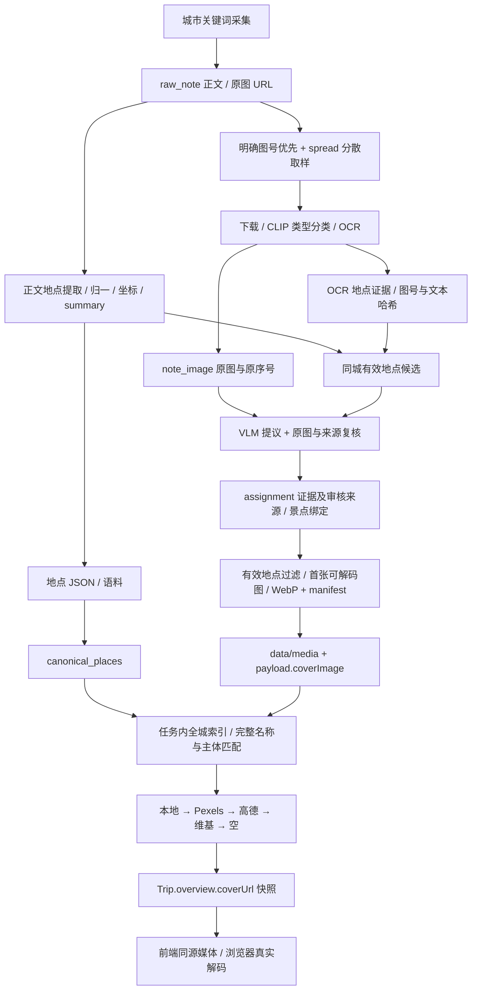

# 配图全链路修复与交付记录

2026-09-30 最新摄影图库试点交付见 [photography-delivery.md](photography-delivery.md)：21张精选、8个目标覆盖，已接入真实生成与署名展示；仍待验收。本文件及第二轮覆盖报告保留为历史对照。

最新：用户要求继续提高覆盖率后，已开展第二轮；当前结果见 [coverage-round2.md](coverage-round2.md)。以下保留第一轮交付快照。

2026-09-30。实现与自测记录，不代表用户验收；未提交、未归档。

## 原因与数据量

目录中文件多，并不等于行程候选有图。初始杭州 235 篇笔记、2757 个原图 URL 槽位，424 张 scenery 仅 91 张有关联，覆盖 34 个地点；排除无效地点后，下游只有 33 个地点有本地图。669 个可导出地点中，绝大多数尚无已确认照片。

1. 156 篇笔记包含多个地点，旧自动归属主要依赖单地点笔记；CLIP 的 scenery 分只能判断类型，不能证明具体景点。
2. 默认只取每篇前 6 张，1390 个 URL 槽位在第 7 张以后；六和塔的明确对应图在 p15，旧预算顺序会漏掉。
3. 下游首次查询把局部结果当成全城缓存，后续候选即使有图也拿不到；括注展示名进一步导致已有图片不命中。
4. 开发端 `/media` 未正确代理，图片请求可能拿到 HTML。Wikimedia 的服务器代理可达，也不代表浏览器能直接加载。
5. 行程保存的是 `overview.coverUrl` 快照，补库不会自动刷新历史行程；地点重导还曾覆盖独立维护的图片字段。

## 当前数据流

维基兜底需同时匹配词条名称与坐标，拒绝父景区代替子景点；下载完整缩略图后用同源路径展示，原来源保存在 sidecar。限制 Wikimedia 域名、8 秒超时、禁止跳转、单图 4 MiB、缓存容量检查 256 MiB。

## 上游优化与实际新增

- `sampling.py` 保留原图索引、去重、前中后分散取样；`--target-places` 优先缺图地点明确的 pN/图N，支持 p2、3，不把行程序号当图号。
- `evidence.py` 将 OCR 证据增量接到已有有效地点候选，不增加正文提及次数或推荐分，不从 OCR 创建未解析地点。按原图序号合并，部分失败可重试。
- 审核要求名称与 ID 一致、单张照片、主体与证据明确、原图哈希及当前候选一致；保留模型原始输出。模型建议不能直接写成批准。
- 已跑 40 次真实 VLM 建议并实际看图核验，确认香积寺、雷峰塔、九溪烟树、太子湾公园、六和塔 5 个新增地点，记录为 agent-reviewed。
- 六和塔真实提取补到了原序号 14（p15）；利用明确正文图号解决旧前 6 张策略遗漏。
- 杭州可用本地图地点 **33 → 38**；当前 428 张 scenery、96 张有关联、39 个原始关联地点，排除无效地点后导出 38。关联图片数不能当作覆盖地点数。

## 历史行程与真实生成

- 原行程 `0552c0b3-6446-48b9-bf4b-9a11699ce669`：3 → 4 个有图候选，本地图 0 → 3；补灵隐寺、虎跑、六和塔，移除身份不符的断桥维基图。日期、活动、路线不变，有修改前备份和比较更新保护。
- 第一份真实重跑暴露 3 个外链失败，未将失败验证计为通过。
- `0ed2a147-4189-4650-aabe-31eabdde4413`：7 张图片，5 张同源媒体；修复岳王庙外链后，全三天 HTTP 与浏览器解码通过，页面错误 0。
- `7290d15c-abfa-4e81-959f-32ee6027236e`：另一轮真实选点最初仅 2 张，暴露括注匹配漏图。用生产索引重放补回灵隐寺、九溪烟树后 4 张，其中 3 张本地图；三天浏览器验证通过。不同候选组合的图数不可当作同一集合覆盖率比较。
- 最后一次最终代码生成结果另见下方补充及 `live-hangzhou-acceptance-final/result.json`。此前 `bb0a27dc-3012-4549-a0a4-c4958225203b` 被开发服务器热重载中断，轮询返回 404，未计为验证成功。

## 其他城市同步

杭州通过真实浏览器复验后才执行其余城市导出与导入。复核了数据库关联、manifest、本地文件、HTTP 图片类型与 Chrome 解码。

| 城市 | 处理前本地图地点 | 处理后 | 结果 |
|---|---:|---:|---|
| 杭州 | 33 | 38 | 5 个有证据的新地点 |
| 北京 | 6 | 6 | 已同步，无缺文件或坏图 |
| 成都 | 2 | 2 | 已同步，无缺文件或坏图 |
| 广州 | 31 | 31 | 清单 33 → 31，排除 2 个无效地点 |
| 厦门 | 0 | 3 | 已关联但未导入的图片已补齐 |
| 上海 | 0 | 0 | 5 张 scenery 尚无确认关联 |
| 重庆 | 0 | 0 | 无可导出的确认图片 |

合计 80 张本地图浏览器验证全部通过。其他城市没有逐城付费生成行程；验证范围是公共生产媒体路径和真实库内关联。

## 自测与仍存边界

- 上游此前已安装版本：165 个测试通过，排除既有过期 city_bounds 与外部 live_resolve_hangzhou；专用临时 PostgreSQL 真实审核/迁移/导出验证通过。
- 本轮下游 31 个定向测试通过，含 Wikimedia 下载边界、同源降级、括注匹配、全城索引；类型检查与前端构建通过（现有大 chunk 提示）。此前图片导入的隔离数据库测试已通过。
- 仍然缺少多数景点的可靠照片。下一优先级是根据高频行程缺口安排定向补采，再用明确图号/OCR/主体证据复核；不应放宽到“同笔记/同城市就绑定”。
- 尚未实现：自动按目标配额停止与完整本地下载复用、自动缺图关键词采集、图片撤回同步与 gallery 契约、Web 审核界面。空 manifest 不自动删除下游旧封面。
- 缺图仍留空；不会把模型建议、通用湖面或父景区照片伪装成具体子景点照片。

## 最终真实生成与验收入口

最终任务 `d5533d38-9f32-422b-b93c-f2249ad83b75` 正常完成。新行程：
http://localhost:5173/trips/f00889cd-d163-4b3c-b90d-dec61c985b52

共 13 个候选，4 张封面：雷峰塔、灵隐寺、六和塔为本地小红书图片，龙井村为 Pexels。
4 张均 HTTP 200 且为图片，三天页面图片解码全部通过，页面错误 0；截图已查看。
这份最终行程没有命中维基图片；维基本地缓存由另一份真实行程的岳王庙验证。

9 个无图候选：断桥残雪、苏堤、三潭印月、宝石山、飞来峰、九溪十八涧、西溪国家湿地公园、京杭大运河水上巴士、河坊街·南宋御街。
其中未知别名/组合名称仍保守处理：九溪十八涧不直接等同九溪烟树，河坊街·南宋御街不拆成任意单景点取图。
因此最终验证代表「现有图片可靠展示、修复路径有效」，不代表所有行程都能达到较高图片覆盖率。

原始行程也已重新用真实浏览器验证，4 张均正常（3 张本地图），页面错误 0。
可读链路审计：`image-flow-final.json`；完整页面验证：`live-hangzhou-acceptance-final/result.json`；
跨城市 80 张本地图验证：`city-sync-verification.json`。

当前交付等待用户验收。没有创建 Git 提交，没有归档或标记完成。
