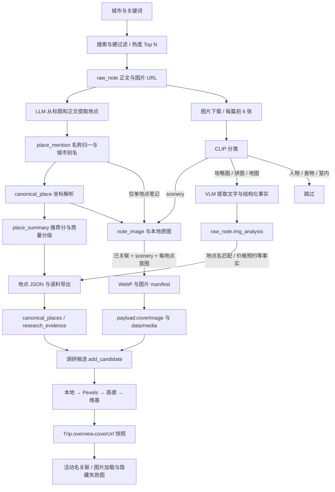

# 配图全链路、当前修复与上游覆盖优化

日期：2026-09-29，以下为初始诊断快照。2026-09-30 已实施上游逻辑调整、真实 API 提取与复核、跨城导入及浏览器验证；当前结果以 [delivery-report.md](delivery-report.md) 为准。未提交或归档。

## 1. 本轮已经处理的内容

| 问题 | 处理 | 验证 |
| --- | --- | --- |
| 只缓存首个候选的封面 | 拆出完整 `loadCityPlaceFacts` 索引 | 首个未命中后，后续主名/别名仍取到图片 |
| 高德缓存图、维基坐标同类缺陷 | `createStoredPlaceLookups` 三种查询共享一份城市索引 | 多名称、并发读取、不同城市隔离测试 |
| Vite `/media` 返回 HTML | 增加代理到 8787 | 两端均返回 image/webp；真实浏览器解码成功 |
| 重导地点清除独立图片字段 | 保留 `coverImage` / `amapPhoto`，其他上游字段正常刷新 | 在隔离 PG 执行真实导入脚本验证 |
| 多图 manifest 以末张覆盖首张 | 同地点保留第一条有效记录 | 两次导入后仍采用第一张 |
| 原行程保留缺图快照 | 灵隐寺改为本地图，虎跑公园新增本地图 | 事务、owner 条件、原 JSON 比较防并发覆盖；重复预览无变化 |

行程 `0552c0b3-6446-48b9-bf4b-9a11699ce669`：12 个候选，图片 URL **3 → 4**，其中本地图 **0 → 2**。新增覆盖的是虎跑公园；灵隐寺是图源替换，因此不是新增两张覆盖。剩余 8 个候选仍无图，不能用不确定的杭州风景强行填满。

原始数据备份在 gitignored 路径：
`data/backups/trip-covers/0552c0b3-6446-48b9-bf4b-9a11699ce669-1790695581652.json`。

## 2. 当前全链路的数据流



这里有两条平行链：**文本事实链**提供选点、预约、价格等信息；**照片链**提供地点封面。给地点/语料补 embedding 不会让未关联照片自动变成可用封面。

### 2.1 采集 → 原始笔记

- 入口：`app/crawl/pipeline.py`、`app/crawl/filter.py`。
- 当前配置采用默认值：收藏 ≥50、图片 ≥3，每关键词最多翻 2 页，从符合条件的结果中按 `收藏×2 + 点赞 + 分享×1.5` 取 Top 10。
- raw_note 保存标题、正文、城市、图片 URL、统计和来源。note_id 冲突时更新统计与图片链接，采集关键词上次为 OK 时默认跳过。
- 这一目标偏向“高价值攻略”，会偏向多地点综合笔记；不能直接作为“单景点照片采集”的最优筛选策略。

### 2.2 正文 → 地点提及 → 规范地点

- `app/extract/llm_extract.py` 的提取输入是标题和正文前 4000 字；没有输入图片或 img_analysis。
- `app/clean/dedup.py` 做 NFKC、括号内容处理、空白处理、繁简转换；`app/clean/alias.py` 再做城市维度别名映射。
- 别名表当前只有北京、成都，没有杭州。这里需要人工确认的同义关系，不能把“西湖/断桥/白堤”当作同一个地点合并。
- `app/aggregate/summary.py` 按城市+规范名建 canonical；当前 `app/resolve/amap.py` 虽然保留历史文件名，实际使用**天地图搜索/地理编码**，坐标转换后落 GCJ-02。当前视野半径常量是 ±1.5°，README 和部分注释里的高德/±0.5°已经落后。
- summary 汇总提及、来源、推荐理由和推荐分；grade 对坐标解析失败的地点禁用，其他按质量分判断。
- 地点导出要求 active、经纬度条件、summary、质量阈值。杭州 682 个 canonical 中 669 个满足导出条件。

### 2.3 图片 URL → 分类 → 原图存储

- 当前网页图片任务：`app/web/jobs.py` → `scripts/extract_note_images.py` → `app/vision/pipeline.py`。
- 默认刷新需要更新的签名 URL，然后处理每篇前 6 张；CLIP 只负责内容类型分类，不负责景点身份识别。
- scenery 按 CLIP 分排序，每篇累计保存最多 5 张（旧脚本默认 3 张，顺序取图）。
- text_card / collage / map 交 VLM，写入 img_analysis；其他类型不做封面。
- 当前杭州有 2757 个图片 URL 槽位；按“每篇前 6 张”规则仅 1367 个能进入一次处理，1390 个在第 7 张及以后。这个是**规则覆盖上限**，不是实测下载失败数，也不能据此说后 1390 张都是好照片。

### 2.4 图片 → 地点关联（主要瓶颈）

- `_NOTE_SELECT` 对整篇笔记的 `COUNT(DISTINCT normalized_name)` 做判断，只在等于 1 时设置 canonical_place_id。
- 杭州 235 篇笔记中：51 篇单地点、156 篇多地点、28 篇未提取出地点。
- 424 张当前有效风景图中：91 张有地点关联、333 张没有；333 张里 304 张来自多地点笔记、29 张来自无提及笔记。
- 没有“单地点但忘记回填”的风景图，所以单独跑旧 `--relink` 对这批主要缺口没有收益。
- 单地点关联本身也只表示“笔记的单一地点”，不保证照片主体一定是该景点；旁边的酒店、远景、沿途画面仍需要图片级验证。

### 2.5 图片导出 → 消费端地点库

- `scripts/export_place_images.py` 只接收 scenery + 已有关联，跨笔记按收藏→点赞→CLIP 分排序，默认每地点导出一张。
- WebP 最长边 1024、quality=80；manifest 的 placeId 为 `sha256(city+name)[:32]`，不是上游自增 ID。
- 下游先导地点，再把图片 key 合并到已有地点 payload；图片本体通过静态路由提供。
- 图片导出与地点导出资格没有对齐，导致已停用“梦溪苑”仍导出图片，而消费端没有地点可挂。34 张 manifest 实际挂到 33 个地点。
- 当前图片导出没有完整的归属证据/方法/审核状态，消费端只有单封面字段。多图导出不会自动形成相册。

### 2.6 消费端选图 → 行程保存 → 页面

- 调研只给 attraction 自动配图；库内名字/别名匹配不做父景点图片继承。
- 首次生成按本地、Pexels、高德缓存/实时、维基依次选择；Pexels/高德/维基均有限额和匹配门槛。
- 本轮修复后，本地图片、坐标和已缓存高德图使用完整城市索引，后续名字不再失效。
- 生成保存 overview 快照；行程加载不重新选图。前端按活动名称关联 overview，图片失败则隐藏，不自动尝试其他图源。

### 2.7 “一键”入口并不等价

| 入口 | 实际执行范围 |
| --- | --- |
| CLI `python -m app.cli run-all` | init-db → crawl → extract → sync → summary → report；不含图片、grade、导出 |
| 网页“一键全链路” | 采集→提取→sync→可选图片→增强→summary→关联对→grade；页面图片选项默认勾选，不含最终导出 |
| 网页“导出 JSON” | 仅地点/事实 JSON，不导图片 |
| 网页“导出并入库” | 默认 with_images=true，地点→图片→embedding |
| PowerShell `export_and_embed.ps1` | 仅显式 `-WithImages` 时导出与导入图片 |

因此“跑完一键”不能当成图片已经进入行程可用库的证据。还应记录各阶段的运行版本、输入输出数、跳过原因与最后成功时间。

## 3. 覆盖数据与优先对象

详细原始计数见 `image-flow-before.json` / `image-flow-after.json`；它们是只读数据库快照，URL 数与不同层级的图片数不能混作同一个分母。

| 城市 | 有效风景图 | 已关联风景图 | 已关联地点 |
| --- | ---: | ---: | ---: |
| 上海 | 5 | 0 | 0 |
| 北京 | 55 | 17 | 6 |
| 厦门 | 121 | 11 | 3 |
| 广州 | 327 | 96 | 33 |
| 成都 | 66 | 7 | 2 |
| 杭州 | 424 | 91 | 34 |

全表合计 998 张风景图，仅 222 张已关联（22.2%）。这不是杭州独有的程序现象。

杭州下游 670 个地点中 33 个有本地图（4.9%）；按上游推荐分排序的前 20 个地点中，只有 6 个有图（30%），前 50 个只有 6 个（12%）。这里的“地点”包含 market 等类型，未筛成纯 attraction。后续产品指标应同时记录各类型分母和真实行程选点覆盖。

建议优先处理的热门缺图地点：

| 地点 | 已确认关联图 | 相关笔记里的未绑定风景图 |
| --- | ---: | ---: |
| 小河直街 | 0 | 31 |
| 雷峰塔 | 0 | 31 |
| 拱宸桥 | 0 | 25 |
| 法喜寺 | 0 | 21 |
| 太子湾公园 | 0 | 49 |
| 龙井村 | 0 | 37 |
| 花港观鱼 | 0 | 41 |
| 三潭印月 | 0 | 20 |

右列只是待检查候选图，不能认定都拍了对应地点，也不能跨地点相加当作去重图片数。

## 4. 上游优化方案（建议顺序）

### P1：先盘活现有素材，补上图片级归属

**推荐优先实施。** 现有 304 张多地点笔记风景图已经在磁盘，不必先重抓小红书。

1. 以每张 note_image 为单位建立候选地点集合：来自同笔记 place_mention，经城市范围、规范化别名和有效 canonical 过滤。候选集合不能只保留已有图的地点。
2. 先提取廉价明确证据：正文中的“图 N / P N”标注、图片内地标招牌/OCR、图与图之间的说明。保留原始 img_index；不能按文字中地点出现顺序机械对应照片顺序。
3. 对热门缺图地点的候选图做小批视觉归属试验：模型只允许从候选 ID 选择，允许返回 unknown；输出画面证据、主体地点、是否只是背景/附近以及置信说明。
4. 先人工核验小样本，再决定自动接受规则。CLIP 的 scenery 分高不等于地点匹配准，模型自报 confidence 也不是经过校准的准确率；阈值需由标注样本验证。
5. 存 `assignment_method`、版本、候选地点、依据、审核状态和时间；低置信/冲突进人工审核，不能靠一个无来源的 canonical_place_id 覆盖旧结果。
6. 对不同地点重复图片、近似图片、泛湖景、酒店借景、景点内子实体做重点抽检。必要时建立 image_place 候选/审核关系表，保留“已确认封面地点”和“仅相关地点”的区别。

首批目标建议：这条行程的 10 个缺本地图景点 + 杭州热门前 20 缺图点。先给每个点找到一张**确认正确**的照片，收益高于给已有图地点追加十张。

### P2：自适应取图，修复 OCR 与地点提取的断点

- 把“永远前 6 张”改成受预算约束的分批取样：前部保留攻略图样本，中后部加入照片样本；当已有足够合格封面时停止。不能简单把所有城市每篇改为全部下载。
- 已有本地图片先复用；仅缺文件/首次处理时下载，按内容 hash 去重。签名 URL 刷新和重新下载不是同一件事。
- 将 OCR 产生的地点证据增量回流到 place_mention，并带 raw_note_id、img_index、extract_version 和 evidence_source。只追加/替换对应图片版本的提取结果，避免每次跑都翻倍累计提及与推荐分。
- 新 OCR 提及进入 sync/summary 后再执行图片归属；不要让增加了地点提及后，原来的“单地点自动关联”静默变成错误关联而仍保留。
- 对当前 28 篇无地点笔记先检查是否图文型攻略，再决定是否重提。不能假设它们全部有可提地点。

### P3：建立面向缺图的采集策略

- 保留现有攻略采集规则，增加独立的“地点照片补齐”用途；按缺图优先级生成“杭州 + 具体景点 + 实拍/摄影”等关键词。
- 照片用途可接受少图、低收藏但主体明确的笔记；不要全局降低攻略入口门槛，避免污染原有事实质量。
- 已经 OK 的关键词默认跳过，需明确的“缺图补齐/过期刷新”模式及时间戳，而不是盲目反复跑原关键词列表。
- 每个热门地点设少量已审核素材目标；达到目标后转去下一个缺图点。沿用限速、预算和失败冷却，不以提高并发解决覆盖不足。

### P4：统一阶段契约与可靠导出

- CLI/Web/PowerShell 使用相同的阶段定义，清楚区分采集完成、图片处理完成、归属完成、导出完成、消费端可用。
- 图片导出与地点导出共享 eligible-place 集合；导入分开记录 attempted / updated / missing，不能只存 manifest 数。
- 图片重分类或地点停用后，应以明确的下线机制取消旧封面引用，而不是仅保留文件让消费者永久复用。
- 地点别名/合并时同步处理 note_image 关联和导出 ID 映射。杭州别名表缺失应经人工核实补齐，不进行景区和子景点的广泛合并。
- 后端可增加候选选图诊断（selected / no_match / quota / network_error）与实际可达率，用户页面仍只呈现景点内容。
- 多图能力需要完整的 cover + gallery 契约；仅加 `--max-per-place` 不会让现有卡片显示多张。

## 5. 如何衡量改进

| 指标 | 当前可观测值 | 作用 |
| --- | --- | --- |
| 关联率 | 杭州 91/424 = 21.5% | 判断图片归属阶段是否改善 |
| 热门地点覆盖率 | 前20：6/20；前50：6/50 | 防止只增加冷门地点图片 |
| 实际行程本地图覆盖 | 本行程 2/12 | 与用户体验直接相关 |
| 图片归属准确率 | 尚无人工标注基准 | 决定能否自动写入，而非只看模型置信度 |
| 文件存在率 / 浏览器加载率 | 34张导出文件均存在；本轮两图解码通过 | 分开衡量存储与交付 |
| 新增已审核地点成本 | 尚未计量 | 比较视觉归属、人工审核、补采三种方式 |

建议先做固定样本试验，把“正确配图率”设为首要质量门槛，再评估覆盖提升。可以把热门前20覆盖达到80%作为后续业务目标，但它不是本轮已实现的结果，也不是仅改缓存就能保证的结果。

## 6. 验证与交付记录

- 32 项相关服务端测试通过，运行在本次新建并销毁的本地测试库。旧 placeFacts 测试中依赖真实北京种子的数据断言在空测试库中提前返回；本轮新增的多地点、别名、跨城、导入回归均使用实际插入的测试数据，不依赖这些跳过路径。
- 根目录 `npm run typecheck` 通过。
- `npm run build` 通过；有既有 bundle 大小提示，无构建错误。
- 新增审计及导入脚本通过单独 TypeScript 配置检查。
- 实际 `/media` 请求：5173 与 8787 均为 image/webp；虎跑样本 162982 字节。
- 内置浏览器不可用，使用本地 headless Chrome 验证：API 提供只读行程快照，图片通过真实 Vite→Fastify；两图 decode 成功，pageerror 为0。验证时拦截外部地图/图库和所有写 API，所以截图不用于证明地图或外链可用。
- 截图：`preview/day1.png`、`preview/day2.png`。
- 原行程补图脚本再次预览为 changes=[]，活动和路线在写前保持完全相同。

可复用审计命令（从 tripweaver 根目录）：

```powershell
node --import tsx apps/server/scripts/audit-xhs-images.ts --city 杭州 --trip-id 0552c0b3-6446-48b9-bf4b-9a11699ce669 --out .trellis/tasks/09-29-hangzhou-image-diagnosis/research/image-flow-after.json
```

本轮没有执行上游大批采集、外部视觉模型识别或不确定图片绑定。上述 P1–P4 是基于代码与数据的后续优化方案，需要分批实现、核验准确率后逐步放开。
