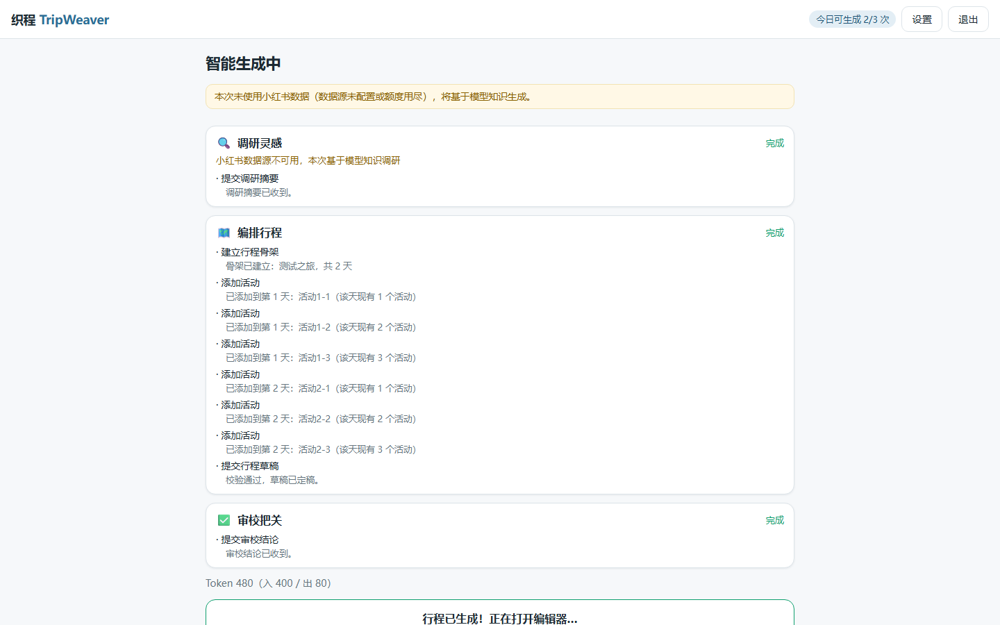
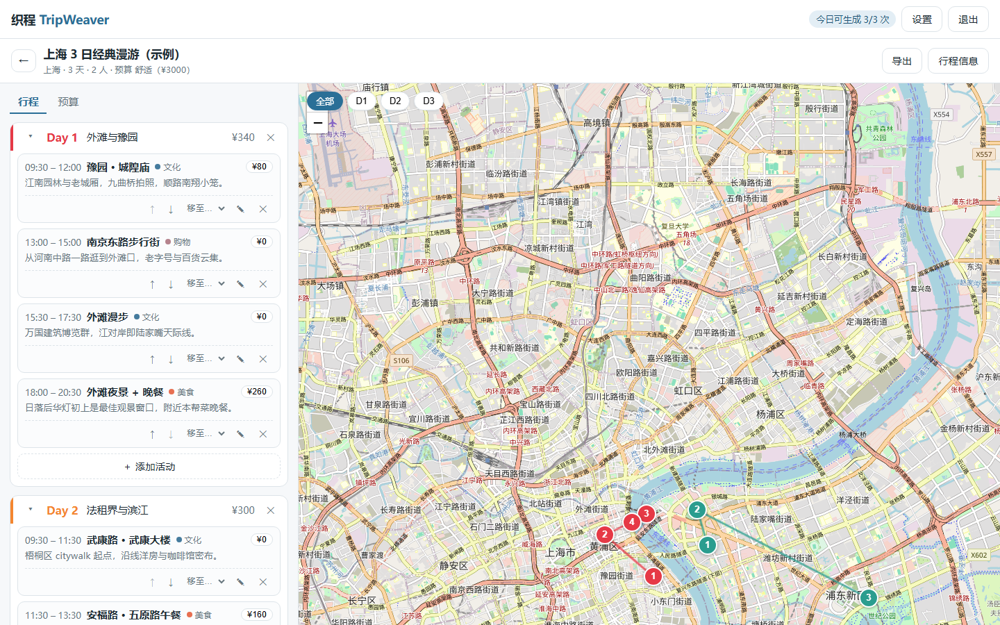

# 织程 TripWeaver

> 多 Agent 协作的开源智能旅行助手 —— AI 替你查真实地点、搜全网攻略、排行程、算预算，落到地图上，一键导出分享。

**织**：三个 AI Agent 像织机一样协作——调研 Agent 从高德地点数据与全网攻略中抽出「经线」（玩法、口碑、预约政策），编排 Agent 织入地理与时间的「纬线」，审校 Agent 验布质检。**程**：交付一份可编辑、可导出的完整行程。

## 功能

- 🧵 **智能行程规划**：输入目的地/天数/预算/偏好，三阶段 Agent 流水线（调研 → 编排 → 审校）生成结构化多日行程，全过程工具调用实时可见
- 🗂️ **行程概览候选池**：调研产出按景点/美食/住宿分类的候选卡片（预览图、简介、**是否需要预约**三态徽章、来源链接），生成中实时长出，随行程留存
- 🔎 **双层调研数据源**：高德搜索POI 2.0（真实地点/评分/人均/营业时间/图片）+ Web 搜索 API（玩法/避雷/预约政策，默认 LangSearch 免费档）；内置全国热门预约景点种子表；任一源缺失自动降级，不影响生成
- 🗺️ **地图可视化**：Leaflet + OSM，按天配色的序号标记与动线折线，天数过滤，坐标来自真实地理编码（Nominatim）
- 💰 **预算计算**：按天/按类别聚合，超支实时预警
- ✏️ **行程编辑**：增删改活动、日内排序、跨天移动，编辑自动保存
- 📤 **导出**：长图（微信分享友好）/ JSON 备份导入 / 打印 PDF
- 👥 **多用户**：开放注册 / GitHub 登录，邀请码模式可随时切回（防滥用备选），行程历史云端留存、每日生成配额、站点供 Key 或用户自带 Key（BYOK）

## 架构

```
React SPA ──HTTP API + SSE──▶ Fastify 路由层 ──▶ 多 Agent 编排（pi-agent-core / pi-ai）
                                   │                 ├─ 调研 Agent ─▶ 高德 POI / Web 搜索
                                   ▼                 ├─ 编排 Agent ─▶ OSM Nominatim
                                SQLite               └─ 审校 Agent ─▶ 预算/动线审查
```

技术栈：React 18 + Vite / Fastify + TypeBox / SQLite + Drizzle / zustand + TanStack Query / Leaflet。详见 [docs/TECHNICAL_ARCHITECTURE.md](docs/TECHNICAL_ARCHITECTURE.md)。

## 截图

| 智能生成（三阶段时间线） | 行程编辑器（清单 + 地图 + 预算） | 移动端 |
|---|---|---|
|  |  |  |

## 快速部署（站长）

```bash
git clone https://github.com/<you>/tripweaver.git && cd tripweaver
cp .env.example .env
# 编辑 .env：至少填 MASTER_KEY（生成命令见文件内注释）、站点 LLM Key
docker compose up -d
```

浏览器打开你的域名（或 `http://服务器IP`），注册即可（默认开放注册；想收紧时设 `REGISTRATION_MODE=invite` + `INVITE_CODE`）。

### 本地开发

```bash
npm install
cp .env.example apps/server/.env   # 填 MASTER_KEY 等
npm run dev                        # server:3001 + web:5173
```

### 环境变量

| 变量 | 必填 | 说明 |
|---|---|---|
| `MASTER_KEY` | ✅ | 32 字节 hex，用户 API Key 的加密主钥 |
| `REGISTRATION_MODE` | | 注册模式 `open` / `invite` / `closed`；**未设置时自动推断**：`INVITE_CODE` 非空 → `invite`，否则 `open`（存量部署升级后行为不变） |
| `INVITE_CODE` | | 邀请码，仅 `invite` 模式使用（该模式下必填）；遇滥用时切 `REGISTRATION_MODE=invite` 即可收紧注册 |
| `GITHUB_CLIENT_ID` / `GITHUB_CLIENT_SECRET` | | GitHub OAuth App 凭据；留空 = 不显示 GitHub 登录 |
| `APP_BASE_URL` | | 站点对外地址（如 `https://trip.example.com`），启用 GitHub 登录时必填，用于构造回调 URL |
| `SITE_LLM_BASE_URL` / `SITE_LLM_API_KEY` / `SITE_LLM_MODEL` | 建议 | 站点供 Key（普通用户零配置使用）；留空 = 纯 BYOK 模式 |
| `GEN_DAILY_LIMIT` | | 每用户每日生成次数（默认 3） |
| `AMAP_KEY` | 建议 | 高德 Web 服务 Key（调研候选：地点/评分/人均/营业时间/图片）；留空 = 该源降级。[申请入口](https://console.amap.com/dev/key/app)，个人认证约 5000 次搜索/月 |
| `AMAP_DAILY_BUDGET` | | 全站高德调用日额度（默认 150，超出自动降级） |
| `SEARCH_API_KEY` | 建议 | Web 搜索 Key（攻略/避雷/预约政策）；留空 = 该源降级。默认 [LangSearch](https://langsearch.com/) 免费申请 |
| `SEARCH_API_BASE_URL` | | 搜索端点，默认 `https://api.langsearch.com`；博查同族接口改 URL+Key 即切换 |
| `SEARCH_DAILY_BUDGET` | | 全站搜索调用日额度（默认 500，超出自动降级） |
| `SSRF_ALLOWLIST` | | BYOK baseUrl 私网豁免（站长自有 Ollama 等） |

### GitHub 登录（可选）

1. 到 GitHub → Settings → Developer settings → **OAuth Apps** → New OAuth App（不是 GitHub App）；
2. Authorization callback URL 填 `<APP_BASE_URL>/api/auth/github/callback`（OAuth App 只允许一个 callback，**本地开发请另注册一个 App**，callback 填 `http://localhost:5173/api/auth/github/callback`）；
3. 把 Client ID / Client Secret 与 `APP_BASE_URL` 写入 `.env` 并重启。

登录只申请 `user:email` 权限，access token 拉取一次身份后即丢弃、不落库；GitHub 已验证邮箱与站内账号相同时自动绑定。`invite`/`closed` 模式下 GitHub 仅允许既有用户登录，不允许创建新账号。

### 推荐模型量级

三 Agent 流水线依赖**可靠的多轮工具调用**。推荐 `deepseek-chat`、`gpt-4o-mini`、`glm-4-air` 及以上量级；小参数本地模型（<7B）容易在工具调用上反复失败——系统有轮次熔断与完整性校验兜底，但体验会明显变差。

### 验证与冒烟脚本

```bash
npm run typecheck                 # 三包类型检查
node scripts/smoke-pi.mjs         # 冒烟：LLM 端点连通（读 apps/server/.env 的 SITE_LLM_*）
node scripts/smoke-sources.mjs    # 冒烟：高德 + Web 搜索数据源连通（未配 Key 时提示并跳过）
node scripts/verify-c2.mjs        # 端到端：生成流水线 + 候选池 + 配额 + BYOK（内置 mock LLM，离线可跑）
node scripts/verify-security.mjs  # 安全走查：越权/限流/Key 泄露/SSRF 等 23 项
node scripts/verify-auth-modes.mjs # 注册三态（open/invite/closed）+ 兼容推断 + GitHub OAuth 路由
npm run build && node scripts/verify-c3.mjs && node scripts/verify-d1.mjs  # 浏览器级验收（需 Playwright）
```

## 调研数据源（高德 + 全网搜索）

调研 Agent 采用「结构化底座 + 攻略语义层」双层数据源，模型知识兜底：

1. **高德搜索POI 2.0**（`AMAP_KEY`）：真实地点的名称/地址/评分/人均/营业时间/官方图片。到[高德开放平台](https://console.amap.com/dev/key/app)创建应用并申请 **Web 服务** 类型 Key，个人实名认证即有约 5000 次/月免费搜索额度（以[官方定价](https://lbs.amap.com/upgrade)为准）
2. **Web 搜索 API**（`SEARCH_API_KEY`）：玩法、避雷与「是否需要预约」等攻略信息，带来源链接。默认 [LangSearch](https://langsearch.com/)（免费）；[博查](https://open.bochaai.com)为同族接口（约 ¥0.036/次），改 `SEARCH_API_BASE_URL` + Key 即可切换
3. **预约种子表**：仓库内置约 50 条全国热门「需预约」景点（故宫/国博/莫高窟/陕历博等），命中即直接标注预约方式与官方链接，离线可用（`apps/server/src/data/reservationSeeds.json`，随仓库维护）

内置纪律与合规边界：

- 串行限速、24h 结果缓存、单次生成调用上限、全站日额度（`AMAP_DAILY_BUDGET` / `SEARCH_DAILY_BUDGET`）四道闸，超出自动降级
- 任一数据源缺失/超额**不影响生成**：自动降级为「仅高德」「仅搜索」或纯模型知识调研，行程会标注实际所用数据源
- 遵守高德服务协议：地点图片仅**热链实时展示、不转存文件**；候选落库只保留名称、短摘要与来源链接；请勿改造为批量采集工具
- 预约信息为搜索抽取 + 种子表，**以官方渠道为准**（卡片附来源链接与免责提示）

## 成本说明（站长）

- 地图 / 地理编码：**零费用**（感谢 OSM 与开源社区）；高德与 LangSearch 免费额度内**近零成本**（单次生成约 3–6 次高德 + 4–8 次搜索调用）
- LLM：一次生成约 5–15 万 token；以 DeepSeek 计约每次几分到一两毛钱。成本三道闸：注册管控（默认开放，可切 `invite` 模式挡陌生人）、每日配额（限次数）、用量落库（`generations` 表可审计，含数据源调用数）
- 用户在高级设置里配置自己的 Key（BYOK）后，其生成不消耗站点 Key

## 安全设计

密码 bcrypt 哈希；API Key AES-256-GCM 加密存储、任何接口不回显明文；httpOnly Cookie 会话；登录/注册限流；BYOK baseUrl 私网黑名单（SSRF 防护）；用户数据严格隔离。详见架构文档 §9。

## 文档

- [产品需求 PRD](docs/PRD.md)
- [技术架构](docs/TECHNICAL_ARCHITECTURE.md)
- [开发计划](docs/DEVELOPMENT_PLAN.md)

## 路线图

- [x] M1 全栈行程编辑器（认证/历史/编辑/地图/预算）
- [x] M2 多 Agent 智能生成（调研/编排/审校 + SSE 进度）
- [x] M3 导出三件套 + 安全走查（微信真机清单见 [docs/WECHAT_CHECKLIST.md](docs/WECHAT_CHECKLIST.md)）
- [x] M4 开源发布（Docker/CI/文档）
- [ ] V1.1 候选：对话式改稿、只读分享页、BYO-MCP、站长后台

## License

[MIT](LICENSE)
